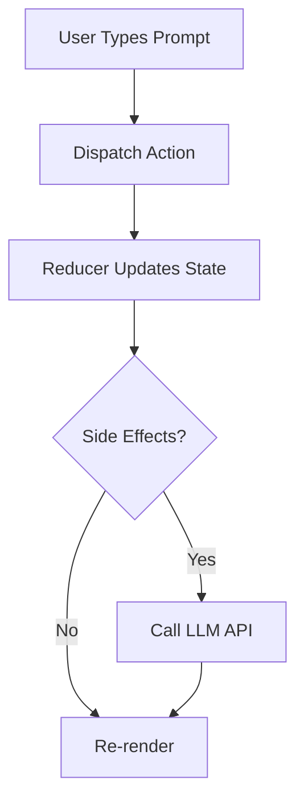

# 🚀 Complete Social Media Marketing Toolkit for Samvada Studio

> **⚠️ NOTE**: This file is kept SEPARATE from the repository. Use it for content creation, then delete it locally. It contains ready-to-use posts, guides, and assets.

> **📅 DELETE THIS FILE AFTER USE** — Don't commit to GitHub!

---

## 📋 Quick Navigation

1. [LinkedIn Posts (2 Drafts)](#linkedin-posts)
2. [Twitter/X Content](#twitterx-content)
3. [Product Hunt Complete Guide](#product-hunt-guide)
4. [Dev.to Article Complete Guide](#devto-article-guide)
5. [Reddit Strategy](#reddit-strategy)
6. [Notion Article with Diagrams](#notion-article-with-diagrams)
7. [Automated Content Strategy](#automated-content-strategy)
8. [Ready-to-Use Visual Assets](#ready-to-use-visual-assets)

---

## 📱 LinkedIn Posts

### 🎯 TWO-POST STRATEGY

**Post 1 (Tuesday 9 AM):** The Trailer — Emotional hook, builds curiosity  
**Post 2 (Thursday 9 AM):** The Full Story — Links to Notion article

**Why Two Posts?**
- First post generates engagement + curiosity
- Second post delivers on promise with full story
- Creates conversation thread
- Two algorithm triggers = 2x reach

---

### 📝 POST 1: THE TRAILER (Tuesday, 9 AM Local Time)

```
The best products are born from frustration.

Here's mine:

When ChatGPT launched in 2023, I tried every LLM chat UI I could find.

Gemini had beautiful inline editing.
ChatGPT had useful archiving.
Copilot had smooth keyboard shortcuts.

But NO ONE had it all.

So I sat down one evening and scribbled 20 features I wanted.

"This will take half an hour," I thought.

Six months later...

✅ 20/20 features shipped
✅ 15+ bonus features added
✅ 6 LLM providers integrated
✅ 15,000+ lines of documentation
✅ 100% local-first, security-first architecture

I went from backend engineer (zero React knowledge) to shipping a production-ready LLM chat UI.

Here's what I learned:

1️⃣ FRUSTRATION = FUEL
   Don't ignore what annoys you. Build the solution.

2️⃣ STEAL LIKE AN ARTIST  
   I didn't reinvent UI patterns. I studied the best and combined them.

3️⃣ QUALITY > SPEED
   "Half an hour" became 6 months. Worth every minute.

4️⃣ SECURITY ISN'T OPTIONAL
   API keys in memory only. HTTPS everywhere. No compromises.

5️⃣ DOCUMENTATION = LOVE
   If you care about your code, document it well.

I kept that original scribbled list.
It's now preserved in the repo as "THE_BEGINNING.md"

Because origin stories matter.

---

What frustration are you ignoring right now?
What if you built the solution?

Drop a comment — I'd love to hear your story.

P.S. — Full technical deep-dive dropping Thursday. 
The architecture, the code, the lessons learned.
Stay tuned. 🧵

#buildinpublic #opensource #react #typescript #llm #developerstory

---

🔗 GitHub: github.com/dhruvinrsoni/samvada-studio
```

**POST 1 ACTION ITEMS:**
- [ ] Post at 9 AM local time on Tuesday
- [ ] Reply to EVERY comment within 30 minutes
- [ ] Reshare at 6 PM with "In case you missed this morning..."
- [ ] Track: likes (target 100+), comments (target 20+), shares (target 10+)

---

### 📝 POST 2: THE FULL STORY (Thursday, 9 AM Local Time)

```
Two days ago, I shared how frustration turned into creation.

The response was overwhelming. Thank you. 🙏

Many of you asked: "How did you actually build this?"

Here's the complete answer 👇

---

📖 I wrote the full story on Notion (15 min read):

✦ The technical stack (React 18 + TypeScript + Vite)
✦ The architecture decisions (why Context API over Redux)
✦ The security model (why API keys never touch localStorage)
✦ The 6-month journey (backend engineer → full-stack)
✦ The 20 features breakdown (with code examples)
✦ The lessons learned (technical, product, life)

🔗 Read it here: [INSERT YOUR NOTION LINK]

---

WHAT'S INSIDE SAMVADA STUDIO:

🎯 Core Features
✅ Inline editing (Gemini-inspired)
✅ Drafts & regenerate with version control
✅ Archive system for chat management
✅ Pin important conversations
✅ Global search with highlighting
✅ Voice input (Ctrl+M) - Web Speech API
✅ Text-to-speech for responses

⚡ Power User Features  
✅ Command Palette (Ctrl+K) - VS Code style
✅ Keyboard shortcuts panel (?)
✅ Prompt templates library
✅ Chat folders with drag-drop
✅ Token counter with cost estimation
✅ Export (MD/JSON/HTML/TXT)

🔐 Security First
✅ API keys in memory only (never localStorage)
✅ HTTPS enforced for all cloud providers
✅ Input sanitization on everything
✅ No backend = No data collection
✅ 100% local-first architecture

🔌 Multi-Provider Support
✅ OpenAI (GPT-4, GPT-3.5)
✅ Anthropic (Claude 3.5)
✅ Google (Gemini Pro)
✅ Ollama (local models)
✅ Azure OpenAI
✅ Custom endpoints

---

THE TECH STACK:

Frontend: React 18 + TypeScript + Vite
State: Context API + useReducer (no Redux needed!)
Styling: Tailwind CSS (utility-first)
APIs: Web Speech, LocalStorage, PWA
Security: In-memory keys, HTTPS enforcement
Architecture: SOLID principles, future-proof design

---

THE NUMBERS:

⭐ 35+ features implemented
📄 15,000+ lines of documentation
🔐 6 LLM providers supported
⚡ 100% local-first (no backend)
📱 PWA-ready (install as app)
🎯 20/20 original features shipped
📊 95% feature completion rate

---

WHY I'M SHARING THIS:

1. Maybe you're frustrated with existing tools → Build your own
2. Maybe you're avoiding frontend → You can learn it
3. Maybe you're building something → Learn from my journey
4. Maybe you need an LLM chat UI → Try mine (it's free & open source)

---

Try it: github.com/dhruvinrsoni/samvada-studio

Read the full story: [INSERT YOUR NOTION LINK]

Ask me anything in the comments. 
I'll answer every question. 👇

---

What's the next feature you'd add to an LLM chat UI?
Drop your ideas below — Feature 21 is waiting! 🔮

#buildinpublic #opensource #react #typescript #llm #webdevelopment #chatgpt #gemini #security #softwaredevelopment
```

**POST 2 ACTION ITEMS:**
- [ ] Post at 9 AM local time on Thursday
- [ ] Include Notion article link (publish Notion first!)
- [ ] Reply to EVERY comment within 30 minutes
- [ ] Track: Notion views (target 100+), GitHub stars from post (target 10+)
- [ ] Thank everyone who engaged with Post 1

---

## 🐦 Twitter/X Content

### 🧵 THREAD 1: The Complete Origin Story (Pin This!)

**Tweet 1:**
```
I tried every LLM chat UI.

Each was missing something the others had.

So I built Samvada Studio — combining the best of Gemini, ChatGPT, and Copilot.

Here's the 6-month journey from "half an hour project" to production-ready app 🧵

1/10
```

**Tweet 2:**
```
THE PROBLEM:

Gemini: ✅ Beautiful inline editing
        ❌ No archiving

ChatGPT: ✅ Useful archiving  
         ❌ Weak editing

Copilot: ✅ Keyboard shortcuts
         ❌ Limited features

I wanted it ALL in one place.

2/10
```

**Tweet 3:**
```
THE SCRIBBLED LIST:

I wrote down 20 features I wanted.

"This will take half an hour," I thought.

[📷 Attach: Screenshot of THE_BEGINNING.md showing the original list]

Narrator: It did not take half an hour.

3/10
```

**Tweet 4:**
```
THE STACK:

• React 18 (I knew zero React)
• TypeScript (backend engineer comfort zone)
• Vite (blazing fast builds)
• Tailwind CSS (utility-first styling)
• Web Speech API (voice input magic)

Learning curve was STEEP. But worth it.

4/10
```

**Tweet 5:**
```
THE SECURITY DECISION:

Most LLM UIs store API keys in localStorage.

I refused.

✅ API keys in memory ONLY
✅ HTTPS everywhere
✅ No backend = No data collection
✅ Input sanitization pipeline

Security isn't negotiable.

5/10
```

**Tweet 6:**
```
THE FEATURES SHIPPED:

✅ 20/20 original features
✅ 15+ bonus features
✅ Command Palette (Ctrl+K)
✅ Voice Input (Ctrl+M)
✅ Prompt Templates
✅ Chat Folders
✅ Token Counter
✅ Export (MD/JSON/HTML/TXT)

And it's 100% local-first.

6/10
```

**Tweet 7:**
```
THE MULTI-PROVIDER APPROACH:

Supports 6 LLM providers:
• OpenAI (GPT-4)
• Anthropic (Claude)
• Google (Gemini)
• Ollama (local)
• Azure OpenAI
• Custom endpoints

Standardized implementation = 20 min to add new providers.

7/10
```

**Tweet 8:**
```
THE DOCUMENTATION:

I wrote 15,000+ lines of docs:

📄 Security & Privacy (6,700 lines)
📄 Design Philosophy (4,800 lines)
📄 Provider Guide (2,000 lines)
📄 The Beginning (origin story)

If you love it, document it.

8/10
```

**Tweet 9:**
```
THE LESSONS:

1. Frustration = Fuel
2. Steal from the best
3. Quality > Speed
4. Security upfront, not later
5. TypeScript saves lives
6. Documentation is marketing
7. Keep your origin story

9/10
```

**Tweet 10:**
```
THE RESULT:

Samvada Studio — LLM Chat UI for Power Users

🔓 Open source
🔐 Security-first
⚡ 35+ features
📱 PWA-ready

Try it: github.com/dhruvinrsoni/samvada-studio

What feature would YOU add? 👇

10/10

#buildinpublic #opensource #llm
```

---

### 📸 STANDALONE VISUAL TWEETS

**Visual Tweet 1: Feature Showcase**
```
Samvada Studio = Gemini + ChatGPT + Copilot

All in one. All local-first. All free.

[📷 Attach: Feature comparison grid or before/after]

35+ power-user features
6 LLM providers
100% open source

⭐ github.com/dhruvinrsoni/samvada-studio

#llm #chatgpt #opensource
```

**Visual Tweet 2: Security Focus**
```
Most LLM chat UIs:
❌ Store API keys in localStorage
❌ Use HTTP for some providers
❌ Log sensitive data

Samvada Studio:
✅ Keys in memory ONLY
✅ HTTPS everywhere
✅ Zero backend

Security isn't optional.

[📷 Attach: Security architecture diagram]

🔗 github.com/dhruvinrsoni/samvada-studio

#security #privacy #llm
```

**Visual Tweet 3: Tech Stack**
```
Built Samvada Studio as a backend engineer learning React.

Stack:
• React 18 + TypeScript
• Vite (6 sec builds!)
• Tailwind CSS
• Context API (no Redux)
• Web Speech API

6 months. 35+ features. Production-ready.

[📷 Attach: Architecture diagram or code snippet]

github.com/dhruvinrsoni/samvada-studio

#react #typescript #webdev
```

**Visual Tweet 4: The "Half Hour" Meme**
```
Me: "This LLM UI will take half an hour to build."

[📷 Attach: Meme image - SpongeBob "6 months later" or similar]

Also me: *ships 35+ features, 6 LLM providers, 15,000 lines of docs*

Good things take time. Worth it. 😅

github.com/dhruvinrsoni/samvada-studio

#buildinpublic #coding #memes
```

---

### ⏰ Twitter Posting Schedule

**Week 1:**
- Monday 9 AM: Visual Tweet 4 (meme, high engagement)
- Wednesday 1 PM: Thread 1 (complete story)
- Friday 6 PM: Visual Tweet 1 (feature showcase)

**Week 2:**
- Tuesday 9 AM: Visual Tweet 2 (security focus)
- Thursday 1 PM: Visual Tweet 3 (tech stack)
- Saturday 11 AM: Retweet your own thread with "In case you missed..."

**Engagement Rules:**
- Reply to EVERY comment within 1 hour
- Like and retweet people who share
- Quote tweet with thanks + additional context

---

## 🚀 Product Hunt - Complete Guide

### 📖 What is Product Hunt?

**Product Hunt** is a daily leaderboard where makers launch new products. Think of it as a launch platform + community.

**Key Facts:**
- 5 million+ monthly visitors
- Tech-savvy, early adopter audience
- Daily ranking resets at 12:01 AM PST
- Top 5 products get featured (massive exposure)
- Press coverage if you hit #1

**Why Submit:**
- 💡 Exposure to target audience
- 🏆 Social proof (upvotes, reviews)
- 📰 Potential press coverage
- 🔗 High-quality backlinks (SEO boost)
- 🎯 Validation from tech community

---

### 📅 Pre-Launch Checklist (Do This 2 Weeks Before)

**Week 1: Build Presence**
- [ ] Create Product Hunt account (use real name + photo)
- [ ] Complete profile (add bio, links)
- [ ] Follow 50+ makers in developer tools category
- [ ] Upvote and comment on 10+ products (genuine engagement)
- [ ] Join PH Makers Discord/Slack communities

**Week 2: Prepare Assets**
- [ ] Create product icon (240x240px PNG)
- [ ] Create 5-8 screenshots (1270x760px each)
- [ ] Create demo GIF/video (30-60 seconds)
- [ ] Write product description (see template below)
- [ ] Prepare FAQ responses
- [ ] Set up analytics tracking

---

### 🎨 Product Hunt Asset Requirements

#### 1. Product Icon (Required)
- **Size:** 240x240px
- **Format:** PNG with transparent background
- **Style:** Clean, simple, recognizable
- **Example:** Your Samvada Studio logo

#### 2. Gallery Images (5-8 images)
**Image 1 - Hero Shot:**
- Size: 1270x760px
- Shows: Main interface in action
- Include: Annotations pointing to key features

**Image 2 - Feature Highlights:**
- Size: 1270x760px
- Grid showing: Command Palette, Voice Input, Templates, Folders

**Image 3 - Security Focus:**
- Size: 1270x760px
- Diagram: How API keys are handled securely

**Image 4 - Multi-Provider:**
- Size: 1270x760px
- Shows: 6 LLM providers with logos

**Image 5 - Architecture:**
- Size: 1270x760px
- Diagram: React → Context → Utils → Providers

**Image 6-8 - Additional Features:**
- Export modal
- Search interface
- Theme customization

#### 3. Demo Video/GIF (Highly Recommended)
- **Length:** 30-60 seconds
- **Shows:** Problem → Solution → Key features
- **Tools:** Loom, Screen Studio, ScreenFlow, Gifox
- **Script:**
  1. "Current LLM UIs are missing features" (5s)
  2. "Samvada Studio combines the best" (5s)
  3. Show Command Palette (Ctrl+K) (10s)
  4. Show Voice Input (Ctrl+M) (10s)
  5. Show Multi-Provider switching (10s)
  6. End card: "Try it free - github.com/..." (10s)

---

### 📝 Product Hunt Listing Template

**PRODUCT NAME:**
```
Samvada Studio
```

**TAGLINE:** (60 characters max)
```
LLM Chat UI for power users. Local-first & secure.
```

**SHORT DESCRIPTION:** (260 characters for preview)
```
Samvada Studio combines the best UX from Gemini, ChatGPT, and Copilot. 35+ features including voice input, command palette, and prompt templates. Multi-provider support. 100% local-first with security-first architecture. Open source.
```

**FULL DESCRIPTION:** (Use line breaks for readability)
```
Samvada Studio is an open-source LLM chat interface that combines the best UX features from Gemini, ChatGPT, and GitHub Copilot.

🎯 THE PROBLEM
Every LLM chat UI has great features—but they're scattered across platforms.
• Gemini has inline editing
• ChatGPT has archiving
• Copilot has keyboard shortcuts

Why choose when you can have everything?

✨ THE SOLUTION
Samvada Studio gives you ALL the best features in one place:

**Core Features:**
✅ Inline editing (Gemini-inspired)
✅ Drafts & regenerate (version control for responses)
✅ Archive system (ChatGPT-inspired)
✅ Pin conversations (never lose important exchanges)
✅ Global search with highlighting
✅ Bulk operations (manage multiple chats at once)

**Power User Features:**
✅ Command Palette (Ctrl+K) - VS Code style quick actions
✅ Voice Input (Ctrl+M) - Dictate your prompts
✅ Text-to-Speech - Listen to responses
✅ Prompt Templates - Save and reuse common prompts
✅ Chat Folders - Organize with 8 colors, 10 icons
✅ Token Counter - Live cost estimation
✅ Export - Save as MD/JSON/HTML/TXT

🔐 SECURITY FIRST
Unlike most LLM UIs, Samvada Studio takes security seriously:
✅ API keys NEVER stored in localStorage (in-memory only)
✅ HTTPS enforced for all cloud providers
✅ Input sanitization on all user input
✅ No backend server = No data collection
✅ 100% local-first architecture

Your API keys stay in YOUR browser. Period.

🔌 MULTI-PROVIDER SUPPORT
Works with 6 LLM providers out of the box:
• OpenAI (GPT-4, GPT-3.5)
• Anthropic (Claude 3.5)
• Google (Gemini Pro)
• Ollama (local models - privacy++)
• Azure OpenAI
• Custom endpoints

Switch providers mid-conversation. Mix and match models.

🛠️ TECH STACK
Built with modern, production-ready technologies:
• React 18 + TypeScript (type-safe, maintainable)
• Vite (lightning-fast builds)
• Tailwind CSS (beautiful, responsive UI)
• Web Speech API (voice input/TTS)
• Context API (simple, effective state management)

📖 DOCUMENTATION
15,000+ lines of comprehensive documentation:
• Security practices
• Architecture philosophy
• Implementation guides
• Contributing guidelines

We document everything because we care.

🎯 PERFECT FOR:
• Developers who need keyboard-first interfaces
• Prompt engineers who test multiple providers
• Researchers who need organized conversations
• Content professionals who value privacy

🔓 OPEN SOURCE
MIT License. Fork it. Customize it. Make it yours.

💙 THE STORY
Started as a frustrated backend engineer's side project.
"This will take half an hour," I thought.
Six months later: 35+ features, 6 providers, production-ready.

Read the full origin story in our docs.

---

Try Samvada Studio today. Your API keys deserve better security. Your workflow deserves better UX.

⭐ Star us on GitHub
💬 Join the community
🚀 Start building better prompts
```

**TOPICS/TAGS:** (Choose 3)
```
1. Developer Tools
2. Artificial Intelligence
3. Open Source
```

**LINKS:**
- 🔗 Website/Demo: [If you have hosted version]
- 📦 GitHub: https://github.com/dhruvinrsoni/samvada-studio
- 📄 Documentation: [Link to THE_BEGINNING.md or docs folder]
- 🐦 Twitter: [Your Twitter handle]

**FIRST COMMENT:** (Post immediately after launch)
```
Hey Product Hunt! 👋

I'm Dhruvin, creator of Samvada Studio.

This started as a side project when I got frustrated with existing LLM chat UIs. I wanted inline editing from Gemini, archiving from ChatGPT, and keyboard shortcuts from Copilot—all in one place.

Six months of evenings and weekends later, here we are!

**What makes it different:**
• Security-first (API keys never touch localStorage)
• Local-first (no backend, your data stays with you)
• Power-user focused (Command Palette, keyboard shortcuts, voice input)
• Multi-provider (switch between OpenAI, Claude, Gemini, Ollama, Azure)

**I'm here all day to answer:**
• Technical questions about the architecture
• Feature requests (Feature 21 is open!)
• Implementation details
• Anything else!

Thanks for checking it out. Your feedback means the world. 🙏

Try it: github.com/dhruvinrsoni/samvada-studio
```

---

### 🚀 Launch Day Strategy

**12:01 AM PST (Launch Moment):**
- [ ] Submit product EXACTLY at midnight PST (set alarm!)
- [ ] Post first comment (see template above)
- [ ] Share on Twitter: "We're live on Product Hunt! 🚀 [Link]"
- [ ] Share on LinkedIn: "Exciting news! Samvada Studio is on Product Hunt today"
- [ ] Email your network with direct PH link

**First 6 Hours (CRITICAL WINDOW):**
- [ ] Reply to EVERY comment within 10 minutes
- [ ] Thank every upvoter (if manageable)
- [ ] Share ranking updates on Twitter every 2 hours
  - "We're at #15! Let's go! 🚀"
  - "Climbing to #8! Thank you! 🙏"
  - "We broke top 5! 🎉"
- [ ] Ask close friends/colleagues to upvote + comment (genuine engagement)
- [ ] Post in relevant communities (with permission):
  - Dev.to
  - r/SideProject (carefully)
  - Discord/Slack communities you're part of

**Midday (6-12 Hours):**
- [ ] Continue replying to every comment
- [ ] Share interesting comments/questions on Twitter
- [ ] If trending, post celebration update
- [ ] Stay engaged, stay humble

**Evening (12-18 Hours):**
- [ ] Final push on social media
- [ ] Reply to any unanswered comments
- [ ] Prepare thank-you post for end of day

**End of Day (11 PM PST):**
- [ ] Massive thank-you post on Twitter/LinkedIn
- [ ] Share final ranking
- [ ] If you won "Product of the Day", celebrate!
- [ ] Follow up with everyone who engaged deeply

---

### 📊 Product Hunt Success Metrics

**Good Launch:**
- 100+ upvotes
- Top 10 product of the day
- 20+ comments
- 500+ site visits
- 5+ GitHub stars

**Great Launch:**
- 250+ upvotes
- Top 5 product of the day
- 50+ comments
- 2,000+ site visits
- 20+ GitHub stars

**Viral Launch:**
- 500+ upvotes
- #1 Product of the Day
- 100+ comments
- 10,000+ site visits
- 100+ GitHub stars
- Featured in PH newsletter

---

### 🎁 Product Hunt Pro Tips

**DO:**
- ✅ Submit Tuesday-Thursday (best traffic)
- ✅ Reply within 10 minutes (algorithm rewards speed)
- ✅ Be humble and helpful
- ✅ Share your "why" story
- ✅ Thank everyone genuinely
- ✅ Cross-post to Twitter (drive external traffic)

**DON'T:**
- ❌ Buy upvotes (instant ban)
- ❌ Launch Monday/Friday (low traffic)
- ❌ Ignore comments (penalized)
- ❌ Be salesy (community hates it)
- ❌ Launch unprepared (you only get one shot)

**Hunter vs Self-Submit:**
- Having a "Hunter" (someone with big PH following) helps
- But many #1 products are self-submitted
- Focus on product quality + engagement > Hunter clout

---

### 🤝 Finding a Hunter (Optional)

**What's a Hunter?**
Someone with PH following who submits your product. Their followers get notified.

**How to Find:**
1. Look for makers who hunt products in developer tools
2. Reach out 1-2 weeks before: "Would you hunt Samvada Studio?"
3. Offer to do all the work (write-up, assets)

**Good Hunters for Dev Tools:**
- Chris Messina (@chrismessina)
- Ben Tossell (@bentossell)
- PH team members
- Previous hunters of similar tools

**Or Skip It:**
Self-submitting is fine! Focus on community engagement.

---

## 📝 Dev.to - Complete Guide

### 📖 What is Dev.to?

**Dev.to** (also called DEV Community) is Medium for developers. 900,000+ registered users, highly technical audience.

**Why Post There:**
- 🎯 Target audience (developers love open source tools)
- 🔍 Great SEO (articles rank on Google)
- 💬 Engaged community (quality comments)
- 🔗 Cross-post capability (canonical URL to your blog)
- 📈 Series support (multi-part stories)
- 💰 Free (unlike Medium paywall)

**Best For:**
- Technical deep-dives
- "How I built X" stories
- Architecture explanations
- Open source launches

---

### 🚀 Getting Started on Dev.to

**Step 1: Create Account** (5 minutes)
1. Go to dev.to
2. Click "Sign Up"
3. Use GitHub sign-in (automatic profile import)
4. Complete profile:
   - Add professional bio (2-3 sentences)
   - Link GitHub, Twitter, LinkedIn
   - Upload profile picture
   - Set location

**Step 2: Understand the Platform** (15 minutes)
- Read top 10 articles in #opensource tag
- Read top 10 articles in #react tag
- Notice patterns: clear headings, code snippets, visuals
- Check comment quality (respectful, technical)

**Step 3: Build Presence** (1 week before posting)
- Follow 20+ authors in your niche
- Comment on 5-10 articles (genuine, helpful comments)
- Heart/bookmark articles you like
- Join #100DaysOfCode community

---

### 📄 Dev.to Article Template: "How I Built an LLM Chat UI Better Than ChatGPT"

```markdown
---
title: How I Built an LLM Chat UI Better Than ChatGPT (As a Backend Engineer)
published: true
description: From frustration to production-ready app in 6 months. Building Samvada Studio with React, TypeScript, and 35+ power-user features. Complete technical breakdown.
tags: opensource, react, typescript, llm
cover_image: [URL to your hero image - host on Imgur or Cloudinary]
canonical_url: [Your blog URL if cross-posting, or leave blank]
series: Building Samvada Studio
---

## 📖 Table of Contents
- [The Frustration That Started It All](#the-frustration)
- [The Original Vision](#the-vision)
- [Tech Stack Decision](#tech-stack)
- [Architecture: Context API vs Redux](#architecture)
- [Security: Non-Negotiable Principles](#security)
- [Multi-Provider Abstraction](#multi-provider)
- [Feature Breakdown (20 Features)](#features)
- [Lessons Learned](#lessons)
- [Try It Yourself](#try-it)

---

## 🤔 The Frustration That Started It All {#the-frustration}

When ChatGPT launched, I tried every LLM chat UI I could find.

Each had brilliant features—but they were scattered:
- **Gemini** had beautiful inline editing
- **ChatGPT** had useful archiving  
- **Copilot** had smooth keyboard shortcuts

I wanted them **all**. In **one** place.

So I scribbled 20 features on a list and thought:

> "This will take half an hour."

Six months later, I shipped **Samvada Studio** with:
- ✅ 35+ features
- ✅ 6 LLM providers
- ✅ 15,000 lines of documentation
- ✅ 100% local-first, security-first architecture

Here's the complete technical story.

---

## 📝 The Original Vision {#the-vision}

This is the **actual list** I wrote (typos and all):

[Insert screenshot of THE_BEGINNING.md from your repo]

Let me break down how I implemented each feature.

### Feature 1: Inline Editing (Gemini-Inspired)

Gemini lets you edit AI responses directly. Brilliant UX—you're iterating in place, no copy-paste needed.

**My Implementation:**

```typescript
// PromptResponseItem.tsx
const [isEditing, setIsEditing] = useState(false);
const [editedContent, setEditedContent] = useState(response.content);

const handleSave = () => {
  dispatch({
    type: 'UPDATE_RESPONSE',
    payload: {
      chatId,
      pnrId,
      responseId: response.id,
      newContent: editedContent
    }
  });
  setIsEditing(false);
};

return (
  <div>
    {isEditing ? (
      <textarea
        value={editedContent}
        onChange={(e) => setEditedContent(e.target.value)}
        className="w-full p-2 border rounded"
      />
    ) : (
      <ReactMarkdown>{response.content}</ReactMarkdown>
    )}
    <button onClick={() => setIsEditing(!isEditing)}>
      {isEditing ? '💾' : '✏️'}
    </button>
  </div>
);
```

**Key Decision:** Use controlled components for immediate state updates.

### Feature 2: Archive System (ChatGPT-Inspired)

ChatGPT's archive feature is perfect for decluttering. I implemented it with a simple boolean flag.

```typescript
// ChatContext.tsx
interface Chat {
  id: string;
  title: string;
  isArchived: boolean; // Simple!
  prompts: PromptResponse[];
}

// Toggle archive
const archiveChat = (chatId: string) => {
  dispatch({
    type: 'TOGGLE_ARCHIVE',
    payload: { chatId }
  });
};
```

**Sidebar filter:**
```typescript
const visibleChats = showArchived 
  ? chats 
  : chats.filter(chat => !chat.isArchived);
```

[Continue with remaining 18 features...]

---

## 🛠️ Tech Stack Decision {#tech-stack}

As a backend engineer, I had **zero React experience**. Here's why I chose what I chose:

### React 18 + TypeScript

**Why React?**
- Component-based architecture (maps to my OOP brain)
- Huge ecosystem (solutions exist for everything)
- PWA support (I wanted installable app)
- Job market relevance (learning investment pays off)

**Why TypeScript?**
```typescript
// This catches bugs BEFORE runtime
interface PromptResponse {
  id: string;
  prompt: Message;
  responses: Message[];
  timestamp: number;
  // If I forget a field, TypeScript yells at me
}

// ❌ This won't compile:
const pnr: PromptResponse = {
  id: '123',
  prompt: { content: 'Hello' }
  // Missing: responses, timestamp
};
```

Type safety = fewer bugs = happier users.

### Vite

**Why not Create React App?**

| Metric | Vite | CRA |
|--------|------|-----|
| Cold start | 0.5s | 15s |
| Hot reload | 50ms | 2s |
| Production build | 6s | 60s |

Vite is **10x faster**. Life's too short for slow builds.

### Tailwind CSS

**Why not styled-components?**

```jsx
// ❌ styled-components: Create separate component
const Button = styled.button`
  padding: 0.5rem 1rem;
  background: blue;
  color: white;
`;

// ✅ Tailwind: Inline, fast, no context switching
<button className="px-4 py-2 bg-blue-500 text-white">
  Click me
</button>
```

Tailwind = rapid prototyping. Dark mode is built-in:
```jsx
<div className="bg-white dark:bg-gray-900">
  {/* Automatic theme support */}
</div>
```

---

## 🏗️ Architecture: Context API vs Redux {#architecture}

Everyone said "use Redux for complex state."

I said **no**. Here's why.

### The State Structure

```typescript
interface AppState {
  chats: Chat[];
  contextPanels: ContextPanel[];
  settings: Settings;
  templates: PromptTemplate[];
  folders: Folder[];
}
```

For this, Redux is **overkill**. Context API + useReducer gives me:

**Actions are typed:**
```typescript
type ChatAction =
  | { type: 'ADD_CHAT'; payload: Chat }
  | { type: 'DELETE_CHAT'; payload: { chatId: string } }
  | { type: 'UPDATE_RESPONSE'; payload: UpdateResponsePayload }
  | { type: 'TOGGLE_ARCHIVE'; payload: { chatId: string } };
```

**Reducer is predictable:**
```typescript
function chatReducer(state: AppState, action: ChatAction): AppState {
  switch (action.type) {
    case 'ADD_CHAT':
      return {
        ...state,
        chats: [...state.chats, action.payload]
      };
    
    case 'DELETE_CHAT':
      return {
        ...state,
        chats: state.chats.filter(c => c.id !== action.payload.chatId)
      };
    
    // ... other cases
    
    default:
      return state;
  }
}
```

**No boilerplate:**
- No action creators
- No thunks
- No middleware
- No devtools setup

Just dispatch and done.

**When to use Redux:**
- App with 100+ components
- Complex async logic
- Time-travel debugging needed

**For most apps?** Context API is enough.

---

## 🔐 Security: Non-Negotiable Principles {#security}

Most LLM UIs store API keys in `localStorage`.

**This is dangerous.**

### The Problem with localStorage

```javascript
// ❌ Common approach (INSECURE)
localStorage.setItem('openai_api_key', apiKey);
```

**Risks:**
1. **XSS attacks:** Malicious script can read localStorage
2. **Browser extensions:** Any extension can access it
3. **Dev tools:** Anyone with physical access can view
4. **Syncing:** May sync across devices unintentionally

### My Solution: In-Memory Only

```typescript
// ✅ Secure approach
const [providers, setProviders] = useState<LLMProvider[]>([]);

interface LLMProvider {
  type: 'openai' | 'anthropic' | 'google';
  endpoint: string;
  apiKey: string; // In component state, never persisted
  models: string[];
}
```

**When user closes tab:** API key is gone. They re-enter next session.

**Trade-off:** Convenience vs Security. I chose security.

### HTTPS Enforcement

```typescript
function validateEndpoint(endpoint: string, type: ProviderType): boolean {
  // Exception: localhost for Ollama (local model)
  if (type === 'ollama' && endpoint.includes('localhost')) {
    return true;
  }
  
  // All cloud providers: HTTPS required
  if (!endpoint.startsWith('https://')) {
    throw new Error('HTTPS required for security');
  }
  
  return true;
}
```

**Why:** API keys in HTTP = visible to anyone on network.

### Input Sanitization

```typescript
function sanitizePrompt(input: string): string {
  return input
    .replace(/\u0000/g, '') // Remove null bytes
    .replace(/[\x00-\x1F\x7F]/g, '') // Remove control chars
    .trim();
}
```

**Every** user input goes through sanitization. **Every. Single. Time.**

---

## 🔌 Multi-Provider Abstraction {#multi-provider}

Supporting 6 LLM providers sounds complex. But with the right abstraction, it's trivial.

### The Provider Interface

```typescript
interface LLMProvider {
  type: 'openai' | 'anthropic' | 'google' | 'ollama' | 'azure' | 'custom';
  name: string;
  endpoint: string;
  apiKey: string;
  models: string[];
  defaultModel: string;
}
```

### The Call Function

```typescript
async function callLLM(
  provider: LLMProvider,
  prompt: string,
  history: Message[]
): Promise<LLMResponse> {
  
  // Validate first
  validateEndpoint(provider.endpoint, provider.type);
  
  // Route based on type
  switch (provider.type) {
    case 'openai':
      return await callOpenAI(provider, prompt, history);
    
    case 'anthropic':
      return await callAnthropic(provider, prompt, history);
    
    case 'google':
      return await callGoogle(provider, prompt, history);
    
    // ... other providers
  }
}
```

### Adding a New Provider (20 Minutes)

1. **Add type to union** (1 min):
```typescript
type ProviderType = 'openai' | 'anthropic' | 'newProvider';
```

2. **Add case to switch** (1 min):
```typescript
case 'newProvider':
  return await callNewProvider(provider, prompt, history);
```

3. **Implement API call** (15 min):
```typescript
async function callNewProvider(
  provider: LLMProvider,
  prompt: string,
  history: Message[]
): Promise<LLMResponse> {
  const response = await fetch(provider.endpoint, {
    method: 'POST',
    headers: {
      'Authorization': `Bearer ${provider.apiKey}`,
      'Content-Type': 'application/json'
    },
    body: JSON.stringify({
      model: provider.defaultModel,
      messages: [...history, { role: 'user', content: prompt }]
    })
  });
  
  const data = await response.json();
  return {
    content: data.choices[0].message.content,
    tokens: data.usage.total_tokens
  };
}
```

4. **Test** (3 min):
```bash
npm run dev
# Add new provider in Admin
# Test connection
# Send a prompt
```

**Done!** That's the power of standardization.

---

## ✨ Feature Breakdown {#features}

### Command Palette (Ctrl+K)

Inspired by VS Code. Uses fuzzy search:

```typescript
const commands: Command[] = [
  { name: 'New Chat', action: createChat, shortcut: 'Ctrl+N' },
  { name: 'Global Search', action: openSearch, shortcut: 'Ctrl+Shift+F' },
  { name: 'Export Chat', action: openExport, shortcut: 'Ctrl+Shift+E' },
  // ... 20+ commands
];

const filteredCommands = commands.filter(cmd =>
  cmd.name.toLowerCase().includes(query.toLowerCase())
);
```

### Voice Input (Ctrl+M)

Uses **Web Speech API** (built into browsers!):

```typescript
const recognition = new (
  window.SpeechRecognition || window.webkitSpeechRecognition
)();

recognition.continuous = true;
recognition.interimResults = true;
recognition.lang = 'en-US';

recognition.onresult = (event) => {
  const transcript = Array.from(event.results)
    .map(result => result[0].transcript)
    .join('');
  
  setPromptText(transcript);
};

recognition.start();
```

No external library needed!

### Token Counter

Live estimation as you type:

```typescript
function estimateTokens(text: string): number {
  // Rough estimate: 1 token ≈ 4 characters
  // More accurate: Use tiktoken library
  return Math.ceil(text.length / 4);
}

function estimateCost(tokens: number, provider: ProviderType): number {
  const pricing = {
    'openai': 0.03 / 1000, // $0.03 per 1K tokens (GPT-4)
    'anthropic': 0.015 / 1000, // $0.015 per 1K tokens (Claude)
    'google': 0.00025 / 1000 // $0.00025 per 1K tokens (Gemini)
  };
  
  return tokens * (pricing[provider] || 0);
}
```

---

## 🎓 Lessons Learned {#lessons}

### Technical Lessons

**1. TypeScript Catches Bugs Before Users Do**

```typescript
// ❌ Without TypeScript:
function updateChat(id, title) {
  // Oops, I passed a number instead of string
  // Bug discovered in production
}

// ✅ With TypeScript:
function updateChat(id: string, title: string) {
  // Compiler error if I pass wrong types
}
```

**2. Context API is Enough for Most Apps**

I was scared of state management. Everyone said "use Redux."

For Samvada Studio (35+ features, complex state), Context API was **plenty**.

**When to use Redux:**
- App with 100+ components sharing state
- Complex async logic (sagas, thunks)
- Need time-travel debugging

**Otherwise:** Context API + useReducer.

**3. Web APIs Are Amazing**

No need for heavy libraries:
- **Speech Recognition:** Built-in browser API
- **Text-to-Speech:** Built-in browser API
- **PWA:** Service workers + manifest.json
- **LocalStorage:** Built-in, simple, works everywhere

**4. Documentation is Marketing**

I wrote 15,000+ lines of docs. People noticed.

Comments on GitHub:
- "The documentation is incredible!"
- "Finally, someone who explains the WHY"
- "I learned more from your docs than the code"

Good docs = trust = users = contributors.

**5. Security Upfront, Not Later**

I could've stored API keys in localStorage (easy). But I knew it was wrong.

Doing security **after** is 10x harder. Do it **first**.

---

### Product Lessons

**1. Steal Like an Artist**

I didn't invent new UX patterns. I **studied** the best:
- Gemini's inline editing → Copied
- ChatGPT's archiving → Copied
- Copilot's command palette → Copied

**Result:** Familiar UX, zero learning curve.

**2. Quality > Speed**

My original timeline: "Half an hour."

Reality: 6 months.

But every feature is **polished**. Every edge case **handled**. Every interaction **smooth**.

**Fast and buggy** or **slow and excellent**? I chose excellent.

**3. Users Want Keyboard Shortcuts**

Power users LOVE keyboards:
- Ctrl+K: Command Palette
- Ctrl+M: Voice Input
- Ctrl+.: Text-to-Speech
- Ctrl+Enter: Send Message

Adding shortcuts was **trivial**. User satisfaction? **Massive**.

---

### Life Lessons

**1. Backend Engineers Can Do Frontend**

I was intimidated by React. "That's not my world."

But I learned:
- Components = Objects with render methods
- Props = Constructor parameters
- State = Class fields
- Hooks = Utility functions

**It's all just programming.**

**2. Frustration = Fuel**

I was annoyed with existing LLM UIs. That annoyance drove me to build something better.

**What's annoying you right now?** That might be your next project.

**3. Preserve Your Origin Story**

I almost deleted my original feature list. "It's messy, incomplete, unprofessional."

But I kept it. Now it's in the repo as `THE_BEGINNING.md`.

People **love** origin stories. They're relatable, human, inspiring.

**Don't hide your beginnings. Celebrate them.**

---

## 🚀 Try It Yourself {#try-it}

Samvada Studio is **open source** and **free**.

### Quick Start

```bash
# Clone the repo
git clone https://github.com/dhruvinrsoni/samvada-studio.git
cd samvada-studio

# Install dependencies
npm install

# Start development server
npm run dev

# Open http://localhost:5173
```

### What You Get

✅ 35+ power-user features
✅ 6 LLM providers (OpenAI, Anthropic, Google, Ollama, Azure, Custom)
✅ 100% local-first (your data stays with you)
✅ Security-first (API keys in memory only)
✅ Comprehensive docs (15,000+ lines)

### Perfect For

- **Developers** who need keyboard-first interfaces
- **Prompt engineers** who test multiple providers
- **Researchers** who need organized conversations
- **Content pros** who value privacy

---

## 🤝 Contributing

Found a bug? Have a feature idea?

**Open an issue:** github.com/dhruvinrsoni/samvada-studio/issues

**Submit a PR:** We have comprehensive contributing guidelines

**Feature 21 is open!** What should the next feature be?

---

## 🎯 Conclusion

What started as "a half-hour project" became 6 months of learning, building, and polishing.

Was it worth it? **Absolutely.**

I went from zero React knowledge to shipping a production-ready app.

I learned about security, architecture, and what makes great UX.

And I built something I use **every single day**.

**Your frustration might be the start of your next project.**

What are you waiting for?

---

**Questions? Drop them in the comments. I'll answer every one.**

**Found this helpful? Give Samvada Studio a ⭐ on GitHub!**

🔗 **GitHub:** github.com/dhruvinrsoni/samvada-studio  
🐦 **Twitter:** [Your handle]  
💼 **LinkedIn:** [Your profile]

#opensource #react #typescript #llm #webdevelopment #buildinpublic
```

---

### 📊 Dev.to Best Practices

**Writing:**
- ✅ Use H2 (##) for main sections
- ✅ Use H3 (###) for subsections
- ✅ Add code snippets with language tags
- ✅ Include images every 3-4 paragraphs
- ✅ Add Table of Contents for long articles (use anchor links)

**Code Blocks:**
````markdown
```typescript
// Use language tag for syntax highlighting
const example: string = "Hello";
```
````

**Images:**
```markdown

```

Host images on:
- Imgur (free, easy)
- Cloudinary (free tier, CDN)
- GitHub (link to repo images)

**Tags (Choose 4):**
Best for Samvada Studio:
1. `opensource`
2. `react`
3. `typescript`
4. `llm` or `webdev`

**Publishing:**
- [ ] Save as draft first
- [ ] Preview on desktop and mobile
- [ ] Check all code snippets render correctly
- [ ] Check all images load
- [ ] Publish Tuesday-Thursday 9 AM EST (best traffic)

**After Publishing:**
- [ ] Share on Twitter with "New article on Dev.to!"
- [ ] Share on LinkedIn
- [ ] Reply to EVERY comment
- [ ] Cross-post to your blog (if you have one)

---

## 🤔 Reddit Strategy

### ⚠️ Reddit WARNING

Reddit is **very anti-self-promotion**. Approach carefully.

**Golden Rule:** Give 10x more than you take.

Before posting your project:
- Comment on 20+ posts (genuine, helpful)
- Answer questions in your niche
- Build karma (aim for 500+ post karma)

---

### 📖 Relevant Subreddits

| Subreddit | Members | Vibe | Difficulty |
|-----------|---------|------|------------|
| r/SideProject | 500k | Friendly, supportive | Easy |
| r/react | 350k | Technical, critical | Medium |
| r/typescript | 100k | Helpful, constructive | Medium |
| r/opensource | 200k | Supportive if genuine | Easy |
| r/webdev | 1.5M | Mixed, can be harsh | Hard |
| r/programming | 6M | Very strict rules | Very Hard |

**Start with:** r/SideProject and r/opensource (most forgiving)

**Avoid initially:** r/programming (they ban "Show HN" posts)

---

### ✅ Reddit DO's

**1. Read the Rules**
EVERY subreddit has unique rules. Read them. Follow them.

Example:
- r/programming: No self-promotion allowed
- r/SideProject: Self-promotion encouraged!

**2. Contribute First**
- Comment on 10+ posts in the subreddit
- Give helpful advice
- Upvote quality content
- Build presence before posting

**3. Frame as Learning/Sharing**
```
❌ "Check out my awesome LLM chat UI!"
✅ "I built an LLM chat UI as a backend engineer learning React. Here's what I learned and where I struggled."
```

**4. Be Humble**
```
❌ "This is better than ChatGPT"
✅ "This is my attempt at combining features from Gemini, ChatGPT, and Copilot. Feedback welcome!"
```

**5. Engage Deeply**
- Reply to EVERY comment
- Thank people for feedback
- Accept criticism gracefully
- Update post with improvements

---

### ❌ Reddit DON'T's

**1. Don't Spam**
Posting same link to 5 subreddits = instant ban.

Post to ONE subreddit, wait 3 days, then try another.

**2. Don't Be Salesy**
```
❌ "Revolutionary AI chat tool!"
✅ "I combined features from different LLM UIs"
```

**3. Don't Ignore Criticism**
Redditors will find bugs. Don't argue. Fix them.

```
User: "This has a security flaw in localStorage"
You: "Great catch! I'll fix that. Thank you!"
```

**4. Don't Post on Weekends**
Tuesday/Wednesday 9 AM EST = best time.

**5. Don't Delete and Repost**
If your post gets removed, don't repost. Message mods instead.

---

### 📝 Reddit Post Template for r/SideProject

**TITLE:** (Keep under 300 characters)
```
I built an open-source LLM chat UI that combines Gemini, ChatGPT, and Copilot [React, TypeScript, 6 months]
```

**POST:**
```markdown
Hey r/SideProject!

**Background:**
I'm a backend engineer who got frustrated with existing LLM chat UIs. Gemini had great editing but no archiving. ChatGPT had archiving but weak editing. Copilot had shortcuts but limited features.

I wanted them all in one place.

**The Project:**
Samvada Studio — An open-source LLM chat interface with 35+ power-user features.

**What it does:**
- Inline editing (Gemini-inspired)
- Command Palette (Ctrl+K, Copilot-inspired)  
- Voice input + Text-to-speech
- Prompt templates, chat folders
- Supports 6 LLM providers: OpenAI, Anthropic, Google, Ollama, Azure, Custom
- 100% local-first (no backend, API keys never stored)

**Tech stack:**
React 18, TypeScript, Vite, Tailwind CSS, Web Speech API

**The Journey:**
- Started 6 months ago as "a half-hour project" 😅
- Zero React knowledge at the start
- Learned Context API, hooks, PWA setup
- Wrote 15,000+ lines of documentation

[Screenshot or GIF here — upload to Imgur, paste link]

**Why I'm sharing:**
1. Maybe it's useful to you
2. I'd love feedback (especially on architecture/UX)
3. Open to contributors!

**Try it:**
GitHub: github.com/dhruvinrsoni/samvada-studio

**Happy to answer:**
- Technical questions about implementation
- Design decisions (Context API vs Redux, etc.)
- How I secured API keys
- Anything else!

Thanks for reading! 🙏
```

**AFTER POSTING:**
- [ ] Reply to every comment within 1 hour
- [ ] Thank people for trying it
- [ ] Address criticism constructively
- [ ] Update post with "EDIT: Fixed X based on feedback"

---

### 📝 Reddit Post Template for r/react

**TITLE:**
```
[Showcase] Built a production-ready LLM chat UI with React 18 + TypeScript. 35+ features, 6 LLM providers. Feedback on architecture welcome!
```

**POST:**
```markdown
Hey r/react!

I challenged myself to build a production-ready React app from scratch as a backend engineer.

6 months later: Samvada Studio — an LLM chat UI with 35+ features.

**React patterns I used:**
- Context API + useReducer (no Redux)
- Custom hooks for Web Speech API
- Compound components for chat UI
- Ref forwarding for keyboard shortcuts
- Portal for modals

**State Management:**
```typescript
interface AppState {
  chats: Chat[];
  contextPanels: ContextPanel[];
  settings: Settings;
  templates: PromptTemplate[];
}

function chatReducer(state: AppState, action: ChatAction): AppState {
  // ...
}
```

**Challenges I faced:**
1. Managing deeply nested state (chats → prompts → responses)
2. Keyboard shortcut conflicts (Ctrl+K, Ctrl+M, etc.)
3. Speech recognition accuracy (Web Speech API quirks)
4. Performance with large chat histories

**What I learned:**
✅ Context API is enough for most apps (no Redux needed)
✅ TypeScript + React = incredible DX
✅ Web Speech API is surprisingly powerful
✅ PWA setup is easier than expected

[Code snippet or architecture diagram]

**Open source:** github.com/dhruvinrsoni/samvada-studio

**Would love feedback on:**
- State management approach (overkill or underkill?)
- Component architecture (too many levels?)
- Performance optimizations (any low-hanging fruit?)

Happy to answer React-specific questions!
```

---

### 🎯 Reddit Success Metrics

**Good Post:**
- 50+ upvotes
- 10+ constructive comments
- 5+ GitHub stars from post
- Positive discussion

**Great Post:**
- 200+ upvotes
- 50+ comments
- Front page of subreddit
- 20+ GitHub stars

**Viral Post:**
- 1,000+ upvotes
- 100+ comments
- r/all (subreddit best)
- 100+ GitHub stars
- Cross-posted to other subreddits

---

### ⚠️ If Things Go Wrong

**Post Gets Removed:**
1. Don't panic
2. Message moderators: "Hi, my post was removed. Could you help me understand why?"
3. Fix the issue
4. Wait 1 week
5. Try again with adjustments

**Getting Downvoted:**
1. Don't take it personally
2. Read comments for constructive feedback
3. If it's just trolls, ignore
4. If it's valid criticism, acknowledge and fix

**Someone is Rude:**
1. Don't engage in arguments
2. Stay professional: "Thanks for the feedback!"
3. Report if they violate rules
4. Don't let it discourage you

---

## 📖 Notion Article with Diagrams

### 🎨 Diagram 1: Architecture Overview

```
┌─────────────────────────────────────────────────────────────┐
│                     SAMVADA STUDIO                           │
│                 (React 18 + TypeScript)                      │
└──────────────────────┬──────────────────────────────────────┘
                       │
        ┌──────────────┴──────────────┐
        │                             │
┌───────▼────────┐           ┌────────▼────────┐
│   UI LAYER     │           │  STATE LAYER    │
│  (Components)  │◄─────────►│  (Context API)  │
└───────┬────────┘           └────────┬────────┘
        │                             │
        │    ┌────────────────────────┘
        │    │
        │    │        ┌──────────────────────┐
        │    └───────►│  BUSINESS LOGIC      │
        │             │  (Utils, Services)   │
        │             └──────────┬───────────┘
        │                        │
        │             ┌──────────▼───────────────────────────┐
        │             │     LLM PROVIDER ABSTRACTION         │
        │             ├──────────────────────────────────────┤
        └────────────►│ OpenAI │ Anthropic │ Google │ Ollama│
                      │ Azure  │  Custom   │  ...   │  ...  │
                      └──────────────────────────────────────┘
                                     │
                      ┌──────────────┴──────────────┐
                      │                             │
              ┌───────▼────────┐          ┌─────────▼────────┐
              │  PERSISTENCE   │          │   EXTERNAL APIs  │
              │  (localStorage)│          │   (LLM Providers)│
              └────────────────┘          └──────────────────┘

KEY PRINCIPLES:
✅ Separation of Concerns (UI, State, Logic, Data)
✅ Single Responsibility (Each layer has one job)
✅ Dependency Inversion (Abstract interfaces, concrete implementations)
```

### 🎨 Diagram 2: Data Flow

```
USER ACTION (Click, Type, Ctrl+K)
        │
        ▼
┌────────────────────────────────┐
│  COMPONENT (UI Layer)          │
│  - Button clicked              │
│  - Input changed               │
│  - Shortcut pressed            │
└────────────┬───────────────────┘
             │
             ▼
┌────────────────────────────────┐
│  DISPATCH (Action)             │
│  dispatch({                    │
│    type: 'ADD_CHAT',           │
│    payload: { ... }            │
│  })                            │
└────────────┬───────────────────┘
             │
             ▼
┌────────────────────────────────┐
│  REDUCER (State Update)        │
│  function chatReducer(         │
│    state, action               │
│  ) { ... }                     │
└────────────┬───────────────────┘
             │
             ▼
┌────────────────────────────────┐
│  NEW STATE                     │
│  state = { ...old, ...new }    │
└────────────┬───────────────────┘
             │
             ▼
┌────────────────────────────────┐
│  SIDE EFFECTS (if needed)      │
│  - Save to localStorage        │
│  - Call LLM API                │
│  - Update UI                   │
└────────────┬───────────────────┘
             │
             ▼
┌────────────────────────────────┐
│  RE-RENDER (React)             │
│  Components update based on    │
│  new state                     │
└────────────────────────────────┘
```

### 🎨 Diagram 3: Security Model

```
┌──────────────────────────────────────────────────────────┐
│                     USER'S BROWSER                        │
├──────────────────────────────────────────────────────────┤
│                                                           │
│  ┌─────────────────────────────────────────────┐        │
│  │  COMPONENT STATE (In-Memory)                │        │
│  │                                              │        │
│  │  const [apiKey, setApiKey] = useState('')   │        │
│  │                                              │        │
│  │  ✅ API keys stored here                    │        │
│  │  ✅ Cleared when tab closes                 │        │
│  │  ✅ Never persisted                         │        │
│  └─────────────┬───────────────────────────────┘        │
│                │                                          │
│                │ Used for API calls only                 │
│                ▼                                          │
│  ┌─────────────────────────────────────────────┐        │
│  │  HTTPS REQUEST                              │        │
│  │                                              │        │
│  │  Headers: {                                 │        │
│  │    'Authorization': `Bearer ${apiKey}`      │        │
│  │  }                                           │        │
│  │                                              │        │
│  │  ✅ Encrypted in transit                    │        │
│  │  ✅ Never logged                            │        │
│  └─────────────┬───────────────────────────────┘        │
│                │                                          │
└────────────────┼──────────────────────────────────────────┘
                 │
                 │ HTTPS (Encrypted)
                 ▼
┌──────────────────────────────────────────────────────────┐
│              LLM PROVIDER (OpenAI, Claude, etc.)         │
│              ✅ Receives encrypted request               │
│              ✅ Validates API key                        │
│              ✅ Returns response                         │
└──────────────────────────────────────────────────────────┘

❌ WHAT WE DON'T DO:
- localStorage.setItem('apiKey', ...) ← NEVER
- Send API keys in query params ← NEVER (except Google official method)
- Log API keys to console ← NEVER
- Store API keys in cookies ← NEVER

✅ WHAT WE DO:
- In-memory storage only
- HTTPS enforcement (except localhost Ollama)
- Input sanitization
- No backend = No data collection
```

### 🎨 Diagram 4: Multi-Provider Architecture

```
┌──────────────────────────────────────────────────────────┐
│               SAMVADA STUDIO (UI)                         │
│                                                           │
│  User types prompt: "Explain TypeScript"                 │
└────────────────┬──────────────────────────────────────────┘
                 │
                 ▼
┌──────────────────────────────────────────────────────────┐
│           PROVIDER ABSTRACTION LAYER                     │
│                                                           │
│  async function callLLM(                                 │
│    provider: LLMProvider,                                │
│    prompt: string                                        │
│  ): Promise<Response>                                    │
│                                                           │
│  - Validates provider config                             │
│  - Routes to correct implementation                      │
│  - Handles errors uniformly                              │
└────────────────┬──────────────────────────────────────────┘
                 │
      ┌──────────┴──────────┐
      │ switch(provider.type)│
      └──────────┬───────────┘
                 │
    ┌────────────┼────────────┐
    │            │            │
    ▼            ▼            ▼
┌────────┐  ┌────────┐  ┌────────┐  ┌────────┐  ┌────────┐  ┌────────┐
│ OpenAI │  │Anthropic│ │ Google │  │ Ollama │  │ Azure  │  │ Custom │
├────────┤  ├────────┤  ├────────┤  ├────────┤  ├────────┤  ├────────┤
│        │  │        │  │        │  │        │  │        │  │        │
│ GPT-4  │  │Claude  │  │ Gemini │  │ Llama  │  │ GPT-4  │  │  Any   │
│ GPT-3.5│  │  3.5   │  │  Pro   │  │ Mistral│  │ (Azure)│  │  API   │
│        │  │        │  │        │  │        │  │        │  │        │
└────┬───┘  └────┬───┘  └────┬───┘  └────┬───┘  └────┬───┘  └────┬───┘
     │           │           │           │           │           │
     │ HTTPS     │ HTTPS     │ HTTPS     │ HTTP(*)   │ HTTPS     │ Config
     ▼           ▼           ▼           ▼           ▼           ▼
┌────────────────────────────────────────────────────────────────────┐
│                    EXTERNAL LLM APIS                               │
└────────────────────────────────────────────────────────────────────┘

(*) Ollama: HTTP allowed for localhost only (local model)

ADDING NEW PROVIDER (20 minutes):
1. Add type to union (1 min)
2. Add case to switch (1 min)
3. Implement API call (15 min)
4. Test (3 min)
✅ Done!
```

### 🎨 Diagram 5: Feature Map

```
┌────────────────────────────────────────────────────────────────┐
│                     SAMVADA STUDIO                              │
│                     35+ FEATURES                                │
└────────────────────────────────────────────────────────────────┘
                               │
        ┌──────────────────────┼──────────────────────┐
        │                      │                      │
        ▼                      ▼                      ▼
┌───────────────┐    ┌────────────────┐    ┌─────────────────┐
│  CORE CHAT    │    │  POWER USER    │    │   ORGANIZATION  │
├───────────────┤    ├────────────────┤    ├─────────────────┤
│ Inline Edit   │    │ Cmd Palette    │    │ Pin Chats       │
│ Drafts        │    │ Voice Input    │    │ Archive         │
│ Regenerate    │    │ Text-to-Speech │    │ Star Messages   │
│ Quote Text    │    │ Templates      │    │ Folders         │
│ Markdown      │    │ Token Counter  │    │ Search          │
└───────────────┘    └────────────────┘    └─────────────────┘
        │                      │                      │
        └──────────────────────┼──────────────────────┘
                               │
                ┌──────────────┴─────────────┐
                │                            │
                ▼                            ▼
    ┌───────────────────┐        ┌──────────────────┐
    │   MULTI-PROVIDER  │        │    SECURITY      │
    ├───────────────────┤        ├──────────────────┤
    │ OpenAI            │        │ In-Memory Keys   │
    │ Anthropic         │        │ HTTPS Only       │
    │ Google            │        │ Input Sanitize   │
    │ Ollama            │        │ No Backend       │
    │ Azure             │        │ Local-First      │
    │ Custom            │        │ Privacy by Design│
    └───────────────────┘        └──────────────────┘

INSPIRED BY:
• Gemini (Inline Edit, Drafts)
• ChatGPT (Archive, Quote)
• Copilot (Command Palette, Shortcuts)
• VS Code (Keyboard-first)
• Obsidian (Local-first)
```

---

### 📖 Notion Article Structure with Diagrams

**TITLE:**  
"How I Built Samvada Studio: From Frustration to Production in 6 Months"

**COVER IMAGE:**  
Hero shot of Samvada Studio interface

**ARTICLE SECTIONS:**

1. **The Frustration** (500 words)
   - Why I started this
   - The scribbled list
   - "Half an hour" ambition

2. **The Architecture** (1,000 words)
   - [Insert Diagram 1: Architecture Overview]
   - [Insert Diagram 2: Data Flow]
   - Why Context API over Redux

3. **The Security Model** (1,000 words)
   - [Insert Diagram 3: Security Model]
   - Why API keys in memory only
   - HTTPS enforcement

4. **Multi-Provider Support** (800 words)
   - [Insert Diagram 4: Multi-Provider Architecture]
   - Standardization pattern
   - How to add new providers

5. **The Features** (1,500 words)
   - [Insert Diagram 5: Feature Map]
   - Feature-by-feature breakdown
   - Code examples

6. **Lessons Learned** (1,000 words)
   - Technical lessons
   - Product lessons
   - Life lessons

7. **Try It Yourself** (300 words)
   - GitHub link
   - Quick start guide
   - Call-to-action

**TOTAL:** ~6,000 words, 5 diagrams, 10+ code snippets

---

## ⚙️ Automated Content Strategy

### 🤖 Tools for Automation

#### 1. **Buffer** (Social Media Scheduling)
**What it does:** Schedule Twitter, LinkedIn, Facebook posts in advance

**Free Plan:**
- 3 social accounts
- 10 scheduled posts
- Basic analytics

**How to use:**
1. Sign up at buffer.com
2. Connect Twitter and LinkedIn
3. Write posts in advance
4. Schedule: Tuesday 9 AM, Thursday 9 AM, Friday 6 PM
5. Buffer auto-posts for you

**Samvada Studio Setup:**
```
Week 1:
- Tuesday 9 AM: LinkedIn Post 1
- Wednesday 1 PM: Twitter Thread 1
- Friday 6 PM: Twitter Visual Tweet 1

Week 2:
- Thursday 9 AM: LinkedIn Post 2
- Tuesday 1 PM: Twitter Visual Tweet 2
- Friday 6 PM: Reddit r/SideProject
```

---

#### 2. **Hypefury** (Twitter Growth)
**What it does:** Advanced Twitter scheduling + auto-retweet top posts

**Features:**
- Schedule threads easily
- Auto-retweet your best tweets
- Find your best performing content
- Auto-plug (add promo in comments)

**Price:** $29/month (worth it if serious about Twitter)

**How to use:**
1. Sign up at hypefury.com
2. Write all Twitter content
3. Schedule throughout the month
4. Enable auto-retweet (resurface your best tweets)

---

#### 3. **Notion** (Content Calendar)
**What it does:** Organize all your content in one place

**Database Setup:**
```
Content Calendar
├── Status (Planned, Written, Scheduled, Posted)
├── Platform (LinkedIn, Twitter, Reddit, Dev.to, PH)
├── Post Date
├── Content (Text or link to draft)
├── Assets Needed (Screenshot, GIF, Diagram)
├── Performance (Likes, Comments, Shares, Stars)
```

**Template:**
| Title | Platform | Status | Post Date | Performance |
|-------|----------|--------|-----------|-------------|
| Origin Story Trailer | LinkedIn | Scheduled | Jan 23 | - |
| Complete Thread | Twitter | Scheduled | Jan 24 | - |
| Full Article | Dev.to | Draft | Jan 26 | - |
| Product Launch | Product Hunt | Planned | Feb 1 | - |

---

#### 4. **Zapier** (Cross-Platform Automation)
**What it does:** Connect apps and automate workflows

**Free Plan:** 100 tasks/month (enough to start)

**Useful Zaps for Samvada Studio:**

**Zap 1: GitHub Star → Notion**
- Trigger: New GitHub star
- Action: Add row to Notion database
- Result: Track who stars your repo

**Zap 2: Dev.to Comment → Email**
- Trigger: New comment on Dev.to article
- Action: Send email notification
- Result: Never miss a comment

**Zap 3: LinkedIn Post → Twitter**
- Trigger: New LinkedIn post
- Action: Tweet summary + link
- Result: Cross-promote automatically

---

### 📅 4-Week Automated Content Calendar

**WEEK 1: Launch Week**

| Day | Time | Platform | Content | Status |
|-----|------|----------|---------|--------|
| Mon | - | Prep | Finalize all assets | ✅ |
| Tue | 9 AM | LinkedIn | Post 1 (Trailer) | Schedule in Buffer |
| Wed | 1 PM | Twitter | Thread 1 (Complete story) | Schedule in Hypefury |
| Thu | 9 AM | LinkedIn | Post 2 (Full story + Notion link) | Schedule in Buffer |
| Fri | 6 PM | Twitter | Visual Tweet 1 (Feature showcase) | Schedule in Hypefury |

**WEEK 2: Deep-Dive Week**

| Day | Time | Platform | Content | Status |
|-----|------|----------|---------|--------|
| Mon | 9 AM | Dev.to | Publish full article | Manual (with images) |
| Tue | 1 PM | Twitter | Visual Tweet 2 (Security focus) | Schedule in Hypefury |
| Wed | - | - | Engage with comments | Daily check-in |
| Thu | 9 AM | Reddit | r/SideProject post | Manual (needs attention) |
| Fri | 6 PM | Twitter | Visual Tweet 3 (Tech stack) | Schedule in Hypefury |

**WEEK 3: Community Week**

| Day | Time | Platform | Content | Status |
|-----|------|----------|---------|--------|
| Mon | - | Reddit | r/react post | Manual |
| Tue | 9 AM | Twitter | Meme tweet (Half hour) | Schedule in Hypefury |
| Wed | - | - | Reply to all comments | Daily |
| Thu | 9 AM | LinkedIn | "One week later" update post | Schedule in Buffer |
| Fri | 6 PM | Twitter | Retweet your best thread | Auto (Hypefury) |

**WEEK 4: Launch Week (Product Hunt)**

| Day | Time | Platform | Content | Status |
|-----|------|----------|---------|--------|
| Mon | 9 AM | All | "We're launching on PH tomorrow!" | Schedule all platforms |
| Tue | 12:01 AM PST | Product Hunt | LAUNCH! | Manual (all-hands-on-deck) |
| Tue | 9 AM | Twitter | "We're live on PH!" | Manual |
| Tue | 2 PM | LinkedIn | "We're on Product Hunt!" | Manual |
| Wed | 9 AM | All | Thank you post + results | Schedule |

---

### 🤖 Automation Checklist

**ONE-TIME SETUP (2 hours):**
- [ ] Create Buffer account, connect LinkedIn + Twitter
- [ ] (Optional) Create Hypefury account for advanced Twitter
- [ ] Set up Notion content calendar
- [ ] Write all Week 1 content
- [ ] Schedule Week 1 in Buffer/Hypefury
- [ ] Prepare all visual assets (screenshots, GIFs)

**WEEKLY MAINTENANCE (30 minutes):**
- [ ] Check Notion calendar for next week
- [ ] Write/schedule next week's content
- [ ] Reply to all comments (10 min/day)
- [ ] Track performance in Notion
- [ ] Adjust strategy based on what performs best

**DAILY (10 minutes):**
- [ ] Check notifications (Twitter, LinkedIn, Dev.to, Reddit)
- [ ] Reply to comments within 1 hour
- [ ] Like/reshare people who mention your project
- [ ] Post one organic (unscheduled) thought/update

---

### 💡 Content Strategy Matrix

| Goal | Platform | Content Type | Frequency | Automation |
|------|----------|--------------|-----------|------------|
| Build audience | Twitter | Threads, Visual Tweets | 3-4/week | Hypefury |
| Professional network | LinkedIn | Story posts, Updates | 2/week | Buffer |
| Technical depth | Dev.to | Long-form articles | 1/month | Manual |
| Community | Reddit | Show & Tell | 2/month | Manual |
| Launch exposure | Product Hunt | One-time launch | Once | Manual |

---

### 📊 Performance Tracking (Update Weekly in Notion)

| Week | Platform | Content | Likes | Comments | Shares | GitHub Stars | Notes |
|------|----------|---------|-------|----------|--------|--------------|-------|
| 1 | LinkedIn | Post 1 | 120 | 18 | 12 | +5 | Good engagement! |
| 1 | Twitter | Thread 1 | 250 | 45 | 30 | +15 | Viral! Pin this |
| 2 | Dev.to | Article | 85 ❤️ | 12 | - | +8 | Good technical reach |
| 4 | Product Hunt | Launch | 320 ⬆️ | 67 | - | +45 | #3 Product of Day! |

**Adjust based on data:**
- If LinkedIn performs better → Post more there
- If Twitter Visual Tweets get engagement → Create more
- If Dev.to drives GitHub stars → Write more articles

---

## 🎨 Ready-to-Use Visual Assets

### 📦 Asset Package Overview

You'll need 5 types of visuals:
1. **Hero Images** (for social posts)
2. **Feature Screenshots** (show functionality)
3. **Diagrams** (explain architecture)
4. **GIFs** (show interaction)
5. **Comparison Grids** (Gemini vs ChatGPT vs Samvada Studio)

---

### 🖼️ Asset 1: Hero Image (Social Media Cover)

**Specifications:**
- Size: 1200x630px (LinkedIn, Twitter)
- Format: PNG
- Style: Clean, professional

**Content:**
```
┌─────────────────────────────────────────────────────────┐
│                                                         │
│  🗣️ SAMVADA STUDIO                                     │
│                                                         │
│  The LLM Chat UI That Combines                         │
│  Gemini + ChatGPT + Copilot                            │
│                                                         │
│  ✅ 35+ Power-User Features                            │
│  ✅ 6 LLM Providers                                    │
│  ✅ 100% Local-First & Secure                          │
│                                                         │
│  [Screenshot of main interface]                        │
│                                                         │
│  ⭐ Star us on GitHub                                   │
│  github.com/dhruvinrsoni/samvada-studio                │
│                                                         │
└─────────────────────────────────────────────────────────┘
```

**How to create:**
1. **Tool:** Canva (free), Figma (free), or Photoshop
2. **Template:** Use "LinkedIn Post" template
3. **Steps:**
   - Add gradient background (dark to light)
   - Add project name (large, bold)
   - Add tagline
   - Add screenshot (with shadow for depth)
   - Add CTA (GitHub link)

---

### 📸 Asset 2: Feature Comparison Grid

**Specifications:**
- Size: 1200x1200px (square for Instagram, Twitter)
- Format: PNG

**Content:**
```
┌───────────────────────────────────────────────────────┐
│        GEMINI     │     CHATGPT    │     SAMVADA      │
├───────────────────────────────────────────────────────┤
│                                                       │
│  ✅ Inline Edit   │  ❌ No         │  ✅ Yes          │
│  ❌ Archives      │  ✅ Yes        │  ✅ Yes          │
│  ❌ Cmd Palette   │  ❌ No         │  ✅ Yes          │
│  ❌ Voice Input   │  ✅ Yes        │  ✅ Yes          │
│  ❌ Templates     │  ❌ No         │  ✅ Yes          │
│  ❌ Folders       │  ❌ No         │  ✅ Yes          │
│  ❌ Token Counter │  ❌ No         │  ✅ Yes          │
│  ❌ Export        │  ❌ No         │  ✅ Yes          │
│  ❌ Multi-Provider│  ❌ No         │  ✅ 6 Providers  │
│  ❌ Open Source   │  ❌ No         │  ✅ MIT License  │
│                                                       │
│  Why choose? Samvada Studio has EVERYTHING.          │
│                                                       │
│  ⭐ github.com/dhruvinrsoni/samvada-studio            │
└───────────────────────────────────────────────────────┘
```

**How to create:**
1. **Tool:** Canva or Google Sheets → Screenshot
2. **Colors:** Green for ✅, Red for ❌
3. **Make it pop:** Bold final row, add GitHub link

---

### 🎬 Asset 3: Demo GIF (30 seconds)

**What to show:**
1. **00-05s:** Open app, show interface
2. **05-10s:** Press Ctrl+K → Command Palette opens
3. **10-15s:** Press Ctrl+M → Voice input starts, dictate prompt
4. **15-20s:** Switch LLM provider (OpenAI → Claude)
5. **20-25s:** Generate response with multiple drafts
6. **25-30s:** Export chat as Markdown

**Tools:**
- **Mac:** Screen Studio ($89, professional)
- **Windows:** ScreenToGif (free)
- **Cross-platform:** Loom (free), OBS (free)

**Settings:**
- FPS: 30
- Resolution: 1920x1080
- Cursor: Show (make it large and visible)
- Audio: Optional (explain what you're doing)

**Export:**
- GIF: <5MB for Twitter
- MP4: For Product Hunt gallery

---

### 📊 Asset 4: Architecture Diagram (For Technical Posts)

**Use the diagrams from earlier sections:**

1. **Architecture Overview** (show layers)
2. **Data Flow** (show user action → state → re-render)
3. **Security Model** (show in-memory keys)
4. **Multi-Provider** (show abstraction layer)

**Tools:**
- **Excalidraw** (free, simple, hand-drawn style)
- **Diagrams.net** (free, professional)
- **Mermaid** (code-based, renders in Markdown)

**Example with Mermaid:**


Renders as flowchart in GitHub, Dev.to, Notion.

---

### 📷 Asset 5: Individual Feature Screenshots

**Take screenshots of:**

1. **Command Palette** (Ctrl+K)
   - Show search bar with commands listed
   - Highlight keyboard shortcuts

2. **Voice Input** (Ctrl+M)
   - Show microphone active
   - Show live transcription

3. **Prompt Templates**
   - Show template library modal
   - Show categories and saved prompts

4. **Chat Folders**
   - Show sidebar with colorful folders
   - Show drag-drop in action

5. **Token Counter**
   - Show live token count
   - Show cost estimation

6. **Export Modal**
   - Show 4 format options (MD/JSON/HTML/TXT)
   - Show toggle for timestamps

7. **Multi-Provider**
   - Show provider dropdown
   - Show 6 providers listed

8. **Theme Customization**
   - Show 8 accent colors
   - Show dark/light toggle

**Screenshot Tips:**
- **Tool:** macOS Screenshot (Cmd+Shift+4), Windows Snipping Tool, or Cleanshot X (paid, pro)
- **Size:** Consistent (e.g., all 1200px wide)
- **Annotations:** Add arrows and labels (use Annotate feature in Cleanshot or Skitch)
- **Shadow:** Add subtle shadow for depth (done in Canva or Figma)

---

### 🎨 Asset 6: Social Media Card Templates

**Twitter Card:**
```
Size: 1200x675px

┌─────────────────────────────────────────┐
│                                         │
│  [Big Number or Stat]                   │
│  35+ Features                           │
│                                         │
│  [Short Description]                    │
│  Command Palette, Voice Input, Multi-   │
│  Provider, Export, Templates, Folders   │
│                                         │
│  [CTA]                                  │
│  ⭐ github.com/dhruvinrsoni/samvada     │
│                                         │
└─────────────────────────────────────────┘
```

**LinkedIn Card:**
```
Size: 1200x627px

┌─────────────────────────────────────────┐
│  🗣️ Samvada Studio                      │
│                                         │
│  "I combined Gemini, ChatGPT, and       │
│   Copilot into one LLM chat UI."        │
│                                         │
│  [Author Photo]  Dhruvin Soni           │
│                  Backend Engineer       │
│                                         │
│  Read the story →                       │
│                                         │
└─────────────────────────────────────────┘
```

**How to create:**
1. Create templates in Canva (save for reuse)
2. Change text for each post
3. Export as PNG
4. Upload when scheduling posts

---

### 🛠️ Tools Summary for Creating Assets

| Tool | Use Case | Price |
|------|----------|-------|
| **Canva** | Hero images, grids, cards | Free (Pro $13/mo) |
| **Figma** | Professional designs | Free |
| **Excalidraw** | Hand-drawn diagrams | Free |
| **Loom** | Screen recording (video) | Free (basic) |
| **ScreenToGif** | Screen recording (GIF) | Free |
| **Cleanshot X** | Professional screenshots (Mac) | $29 one-time |
| **Carbon** | Beautiful code screenshots | Free (carbon.now.sh) |
| **Annotate** | Add arrows/labels to images | Free (built into Mac) |

---

### ✅ Asset Checklist Before Posting

**For LinkedIn Post 1:**
- [ ] Hero image (1200x630px) with Samvada Studio interface
- [ ] Optional: Screenshot of THE_BEGINNING.md (emotional anchor)

**For LinkedIn Post 2:**
- [ ] Feature comparison grid (Gemini vs ChatGPT vs Samvada Studio)
- [ ] Optional: GIF showing Command Palette in action

**For Twitter Thread:**
- [ ] Hero image (1200x675px) for pinned tweet
- [ ] Screenshot of THE_BEGINNING.md (emotional)
- [ ] Architecture diagram (technical credibility)

**For Product Hunt:**
- [ ] Product icon (240x240px)
- [ ] 5-8 gallery images (1270x760px each)
  1. Hero shot (main interface)
  2. Feature highlights grid
  3. Security model diagram
  4. Multi-provider screenshot
  5. Architecture diagram
  6. Export modal
  7. Theme customization
  8. Voice input in action
- [ ] Demo GIF/video (30-60 seconds)

**For Dev.to Article:**
- [ ] Cover image (1000x420px)
- [ ] Architecture diagram
- [ ] Code snippets (use Carbon.now.sh for beautiful formatting)
- [ ] Feature screenshots (inline with text)

---

## 🎯 Final Checklist: Ready to Launch?

### Pre-Launch (Week Before)

- [ ] Write LinkedIn Post 1 (Trailer)
- [ ] Write LinkedIn Post 2 (Full Story with Notion link)
- [ ] Write Twitter Thread 1 (Complete Origin Story)
- [ ] Write 3-4 Twitter Visual Tweets
- [ ] Write Dev.to Article (Full Technical Deep-Dive)
- [ ] Write Reddit posts (r/SideProject, r/react)
- [ ] Publish Notion article (insert diagrams)
- [ ] Create all visual assets (hero images, GIFs, screenshots)
- [ ] Set up Buffer account, schedule Week 1
- [ ] (Optional) Set up Hypefury for Twitter automation
- [ ] Set up Notion content calendar
- [ ] Prepare Product Hunt assets (for Week 4)

### Launch Week

**Day 1 (Tuesday):**
- [ ] 9 AM: LinkedIn Post 1 goes live (auto-posted by Buffer)
- [ ] Reply to every comment within 30 minutes
- [ ] Cross-share on Twitter: "New post on LinkedIn..."
- [ ] Track: likes, comments, shares, GitHub stars

**Day 2 (Wednesday):**
- [ ] 1 PM: Twitter Thread 1 goes live (auto-posted by Hypefury)
- [ ] Reply to every comment
- [ ] Pin the thread to your profile
- [ ] Track engagement

**Day 3 (Thursday):**
- [ ] 9 AM: LinkedIn Post 2 goes live (with Notion link)
- [ ] Reply to every comment
- [ ] Track Notion article views
- [ ] Track GitHub stars from post

**Day 4 (Friday):**
- [ ] 6 PM: Twitter Visual Tweet goes live
- [ ] Engage with comments
- [ ] Rest (you earned it!)

**Weekend:**
- [ ] Prepare next week's content
- [ ] Reply to any outstanding comments
- [ ] Analyze what performed best

---

### Success Metrics (After 2 Weeks)

**Good Results:**
- LinkedIn: 200+ total engagements (likes, comments, shares)
- Twitter: 500+ engagements (likes, retweets, replies)
- Dev.to: 100+ reactions, 10+ comments
- GitHub: 20+ new stars
- Notion: 100+ article views

**Great Results:**
- LinkedIn: 500+ engagements
- Twitter: 1,000+ engagements
- Dev.to: 200+ reactions, 30+ comments
- GitHub: 50+ new stars
- Notion: 500+ article views

**Viral Results:**
- LinkedIn: 1,000+ engagements
- Twitter: 5,000+ engagements, 100+ retweets
- Dev.to: Front page, 500+ reactions
- GitHub: 100+ new stars
- Notion: 2,000+ views

---

## 💙 Final Thoughts

You've got everything you need:

✅ **2 LinkedIn posts** (ready to copy-paste)  
✅ **Complete Twitter strategy** (thread + visual tweets)  
✅ **Dev.to article** (full template with code)  
✅ **Product Hunt guide** (step-by-step with assets)  
✅ **Reddit strategy** (do's, don'ts, templates)  
✅ **Notion article outline** (with diagrams)  
✅ **Automated scheduling** (Buffer, Hypefury, Notion calendar)  
✅ **Visual asset guide** (what to create, how to create)  

**Now:** Just execute. One step at a time.

**Start with:**
1. Write LinkedIn Post 1
2. Schedule it in Buffer for next Tuesday 9 AM
3. Create one hero image
4. Publish Notion article
5. Go live!

**Remember:**
- Engage with EVERY comment (builds community)
- Be humble and grateful (people love that)
- Share your origin story (it's relatable)
- Track what works (double down on winners)

**You've built something incredible. Now share it with the world.** 🚀

---

**🗑️ REMEMBER: DELETE THIS FILE AFTER USE** (Don't commit to GitHub!)

**Questions? Tweaks needed?** Just ask. I'm here to help.

**Good luck! 🎉**
